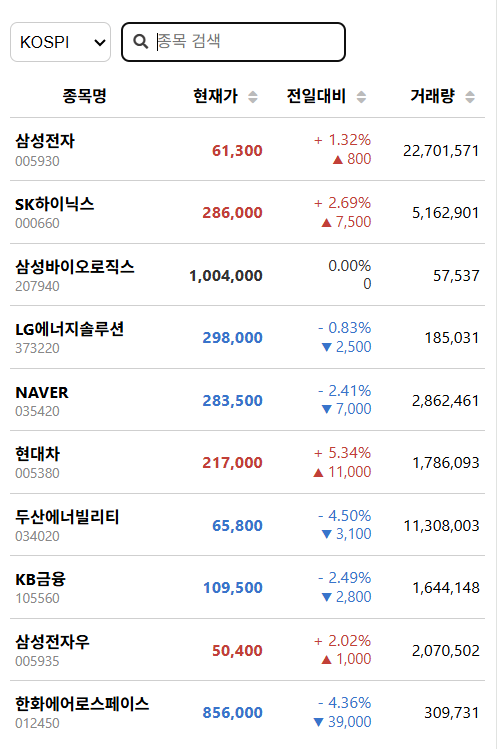

# StockPlus - 한국투자 Open API 기반 주식 시세 현황


## 소개

한국투자증권 Open API를 통해 실시간 주식 시세를 크롬 확장 프로그램 팝업에서 확인할 수 있습니다. 실시간 데이터 업데이트, 정렬, 검색, 무한 스크롤 등의 기능을 제공합니다.



## 개발 기간
2025년 6월 20일 ~ 진행중

## 프로젝트 사용 기술

- **JavaScript (ES6+)**: 전체 로직 및 UI 구현
- **Chrome Extension API**: 백그라운드, 팝업, 메시지 통신 등 확장 프로그램 구조
- **HTML5/CSS3**: UI 마크업 및 스타일링
- **WebSocket**: 실시간 데이터 수신 및 처리
- **한국투자증권 Open API**: 주식 시세 데이터 연동
- **모듈화 구조**: 관심사 분리 및 유지보수성 강화

## 주요 기능

- **실시간 주식 시세**: 한국투자증권 Open API 연동
- **실시간 데이터 업데이트**: WebSocket을 통한 실시간 가격 변동
- **종목 검색**: 종목명 또는 종목코드로 검색
- **마켓별 필터링**: KOSPI, KOSDAQ 선택
- **컬럼별 정렬**: 현재가, 전일대비, 거래대금 기준 정렬
- **공통 API 키**: 개발자가 제공하는 공통 API 키 사용


## 추후 예정 기능

- **즐겨찾기 기능**: 관심 종목을 즐겨찾기로 등록하여 빠른 접근
- **나이트모드**: 다크 테마 지원으로 눈의 피로도 감소
- **시세 알림 기능**: 설정한 가격에 도달했을 때 알림 제공

## 설치 방법

1. 이 저장소를 다운로드 또는 클론합니다.
2. 크롬 브라우저에서 `chrome://extensions` 접속
3. 우측 상단 '개발자 모드' 활성화
4. '압축해제된 확장 프로그램을 로드' 클릭 후 이 폴더 선택
5. 확장 프로그램 아이콘 클릭 시 팝업이 나타납니다.

## API 키 설정

### 중요: API 키 보안

- **API 키는 절대 Git에 커밋하지 마세요!**
- `js/background/env.js` 파일이 `.gitignore`에 포함되어 있습니다
- 실제 API 키가 포함된 파일은 Git에 올라가지 않습니다

### 설정 방법

1. **예시 파일 복사**:

   ```bash
   cp js/background/env.example.js js/background/env.js
   ```

2. **API 키 입력**:
   `js/background/env.js` 파일을 열고 실제 API 키를 입력하세요:

   ```javascript
   export const ENV_CONFIG = {
     APP_KEY: "YOUR_ACTUAL_APP_KEY_HERE",
     APP_SECRET: "YOUR_ACTUAL_APP_SECRET_HERE",
   };
   ```

3. **API 키 발급**:
   - [한국투자증권 개발자센터](https://apiportal.koreainvestment.com/) 접속
   - 회원가입 및 로그인
   - "Open API 신청" 메뉴에서 API 신청
   - APP KEY와 APP SECRET 발급
   - 실시간 API 신청 및 승인 절차 진행

## 프로젝트 구조

```
stock-view-chrome/
├── manifest.json                # 크롬 확장 프로그램 설정 파일
├── popup.html                  # 팝업 UI의 HTML
├── css/
│   ├── layout.css              # 팝업 전체 레이아웃, 컨테이너, 헤더, 스크롤바 등
│   ├── table.css               # 테이블, 정렬, 종목명/코드, 등락/가격/거래량 등
│   ├── components.css          # 버튼, 알림, 로딩, 에러/성공 메시지, 실시간 표시 등
│   └── common.css              # 볼드, 숨김, 중앙정렬 등 공통 유틸리티
├── js/
│   ├── background/
│   │   ├── background.js       # 백그라운드 서비스 워커(메인 진입점)
│   │   ├── config.js           # API 엔드포인트, 환경설정
│   │   ├── env.js              # API 키, HTS_USER_ID 등 민감정보 (Git 제외)
│   │   ├── env.example.js      # 환경변수 예시 (복사해서 env.js로 사용)
│   │   ├── tokenManager.js     # API 토큰 및 승인키 관리
│   │   ├── apiService.js       # 한국투자증권 OpenAPI 호출 및 응답 처리
│   │   ├── realTimeManager.js  # WebSocket 실시간 데이터 관리
│   │   └── messageHandler.js   # 백그라운드 메시지 라우팅 및 분기
│   └── popup/
│       ├── popup.js            # 팝업 메인 로직, 이벤트 바인딩
│       ├── uiManager.js        # UI 렌더링, 테이블/정렬 등 화면 표시 담당
│       ├── dataManager.js      # API 데이터 변환, 검색/필터, UI에 데이터 전달
│       ├── stockSymbols.js     # KOSPI/KOSDAQ 종목명·코드 리스트(검색 자동완성, 조건검색 결과 붙여넣기)
│       └── simple-scrollbar.js # 커스텀 스크롤바 라이브러리
├── stockplus_logo.png          # 확장 프로그램 아이콘
└── README.md                   # 프로젝트 설명 파일
```

## 주요 파일 역할

### 📁 Background Scripts (js/background/)

- **background.js**: 크롬 확장 백그라운드 스크립트, 메인 진입점
- **config.js**: API 엔드포인트, 환경설정 관리
- **env.js**: 실제 API 키, HTS_USER_ID 등 민감정보 (Git 제외)
- **env.example.js**: 환경변수 예시 (복사해서 env.js로 사용)
- **tokenManager.js**: API 토큰 및 실시간 승인키 관리
- **apiService.js**: 한국투자증권 OpenAPI 호출, 조건검색, 종목 데이터 관리
- **realTimeManager.js**: WebSocket 실시간 데이터 연결/구독/해제
- **messageHandler.js**: 백그라운드 메시지 분기 및 서비스 호출

### 📁 Popup Scripts (js/popup/)

- **popup.js**: 팝업 UI의 메인 진입점, 이벤트 바인딩
- **uiManager.js**: UI 렌더링, 테이블/정렬 등 화면 표시 담당
- **dataManager.js**: API 데이터 변환, 검색/필터, UI에 데이터 전달
- **stockSymbols.js**: KOSPI/KOSDAQ 종목명·코드 리스트(검색 자동완성, 조건검색 결과 붙여넣기)
- **simple-scrollbar.js**: 커스텀 스크롤바 라이브러리

### 📁 Styles (css/)

- **layout.css**: 팝업 전체 레이아웃, 컨테이너, 헤더, 스크롤바 등
- **table.css**: 테이블, 정렬, 종목명/코드, 등락/가격/거래량 등
- **components.css**: 버튼, 알림, 로딩, 에러/성공 메시지, 실시간 표시 등
- **common.css**: 볼드, 숨김, 중앙정렬 등 공통 유틸리티

## stockSymbols.js 관리법

- 조건검색 결과(종목명/코드 리스트)를 콘솔에서 복사해 붙여넣기
- 자동 변환 코드 예시:
  ```js
  // 콘솔에서 [{name: "삼성전자", code: "005930"}, ...] 형태로 붙여넣기
  export const stockSymbols = {
    KOSPI: [...],
    KOSDAQ: [...]
  };
  ```

## API 연동 구조

### 1. REST API (현재가 조회)

- **엔드포인트**: `https://openapi.koreainvestment.com:9443/uapi/domestic-stock/v1/quotations/inquire-price`
- **인증**: OAuth 2.0 Bearer Token
- **용도**: 초기 데이터 로드, 주기적 업데이트

### 2. WebSocket (실시간 데이터)

- **엔드포인트**: `ws://ops.koreainvestment.com:21000`
- **용도**: 실시간 가격 변동 수신
- **구독**: 관심 종목 실시간 구독

### 3. 데이터 흐름

```
팝업 → background.js → messageHandler.js → 각 서비스 → API/WebSocket
```

## 개발 가이드

### 새로운 기능 추가

1. 필요한 모듈에 기능 추가
2. `messageHandler.js`에 메시지 핸들러 추가
3. `popup.js`에 UI 로직 추가
4. 해당 CSS 파일에 스타일 추가

### 모듈 구조의 장점

- **관심사 분리**: 각 모듈이 하나의 책임만 담당
- **유지보수성**: 특정 기능 수정 시 해당 모듈만 수정
- **테스트 용이성**: 각 모듈을 독립적으로 테스트 가능
- **재사용성**: 모듈을 다른 프로젝트에서도 사용 가능
- **사용자 편의성**: 별도 설정 없이 즉시 사용 가능

### 에러 처리

- API 호출 실패시 Mock 데이터로 자동 전환
- 네트워크 오류시 사용자에게 알림
- 실시간 연결 끊김시 자동 재연결 시도

## 보안 주의사항

1. **API 키 보안**:

   - `js/background/env.js` 파일이 `.gitignore`에 포함되어 Git에 올라가지 않음
   - 개발자만 API 키를 관리하고 사용자들은 공통 키 사용

2. **API 호출 제한**: 한국투자증권 API는 호출 횟수 제한이 있습니다.
3. **실시간 데이터**: 실시간 데이터는 거래시간에만 제공됩니다.
4. **개발자 모드**: 개발 중에는 크롬 개발자 모드가 필요합니다.

## 참고 자료

- [한국투자증권 Open API 가이드](https://apiportal.koreainvestment.com/apiservice-summary)
- [Chrome Extension 개발 가이드](https://developer.chrome.com/docs/extensions/)
- [WebSocket API 문서](https://developer.mozilla.org/en-US/docs/Web/API/WebSocket)

## 라이선스

이 프로젝트는 MIT 라이선스 하에 배포됩니다.

## 기여하기

1. Fork the Project
2. Create your Feature Branch (`git checkout -b feature/AmazingFeature`)
3. Commit your Changes (`git commit -m 'Add some AmazingFeature'`)
4. Push to the Branch (`git push origin feature/AmazingFeature`)
5. Open a Pull Request
